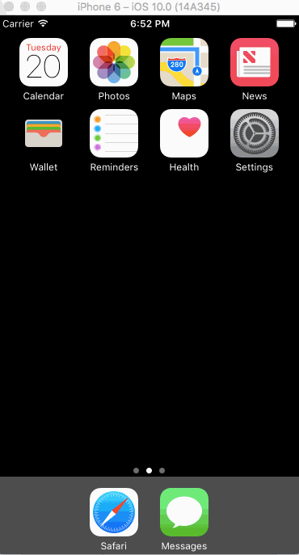

# *iOS Tip Calculator*

**iOS Tip Calculator** is a tip calculator application for iOS with user-selected default settings.

Submitted by: **Jenna Vuong**

Time spent: **8** hours spent in total

## User Stories

The following **required** functionality is complete:

* [ x ] User can enter a bill amount, choose a tip percentage, and see the tip and total values.
* [ x ] Settings page to change the default tip percentage.

The following **optional** features are implemented:
* [ ] UI animations
* [ x ] Remembering the bill amount across app restarts (if <10mins)
* [ ] Using locale-specific currency and currency thousands separators.
* [ ] Making sure the keyboard is always visible and the bill amount is always the first responder. This way the user doesn't have to tap anywhere to use this app. Just launch the app and start typing.

The following **additional** features are implemented:

- [ ] List anything else that you can get done to improve the app functionality!

## Video Walkthrough

Here's a walkthrough of implemented user stories:

GIF created with [LiceCap](http://www.cockos.com/licecap/).

## Notes

Had trouble navigating from `ViewController.swift` (for Tip View) to `SettingsViewController.swift`, exception stopped program flow. Specific error was:

    'NSUnknownKeyException', reason: '[<UIViewController 0x3927310> setValue:forUndefinedKey:]: this class is not key value coding-compliant for the key defaultTip.'

Googled & realized it was the outlets for `SettingsViewController.swift`. Deleted unnecessary `defaultTip` outlet and navigation worked perfectly. Need to figure out how to try-catch exceptions.

## License

    Copyright 2016 Jenna Vuong

    Licensed under the Apache License, Version 2.0 (the "License");
    you may not use this file except in compliance with the License.
    You may obtain a copy of the License at

        http://www.apache.org/licenses/LICENSE-2.0

    Unless required by applicable law or agreed to in writing, software
    distributed under the License is distributed on an "AS IS" BASIS,
    WITHOUT WARRANTIES OR CONDITIONS OF ANY KIND, either express or implied.
    See the License for the specific language governing permissions and
    limitations under the License.

## Tech Stack

    Swift 3
    XCode
